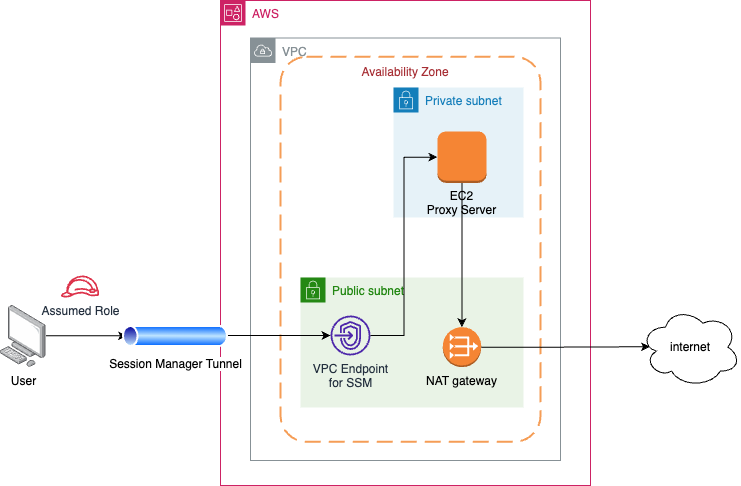

# CDK for Proxy Server in AWS

A demo for setting up a proxy server in AWS created for this [this article](https://medium.com/p/4e97d1508be6/).

The stacks can be found in cdk/bin/cdk.ts

# Architecture

This architecture was built based on [this article](https://aws.amazon.com/blogs/mt/amazon-ec2-instance-port-forwarding-with-aws-systems-manager/).

# Tunneling
## Prerequisites
* SSH client (for windows, see http://www.openssh.com/, for example)
* [AWS CLI](https://docs.aws.amazon.com/cli/latest/userguide/getting-started-install.html)
* [Session Manager plugin for AWS CLI](https://docs.aws.amazon.com/systems-manager/latest/userguide/session-manager-working-with-install-plugin.html)
* AWS role configured with access to SSH

## Connecting/Disconnecting
### MacOS/Linux
* Assume the deployed 'proxy-user-role' role in your terminal session.
* Connect to proxy: `./scripts/unix/connect.sh`
* Disconnect from proxy: `./scripts/unix/disconnect.sh`

### Windows
* Assume the deployed 'proxy-user-role' role in your terminal session.
* Connect to proxy: `./scripts/cmd/connect.cmd`
* Disconnect from proxy: `./scripts/cmd/disconnect.cmd`
